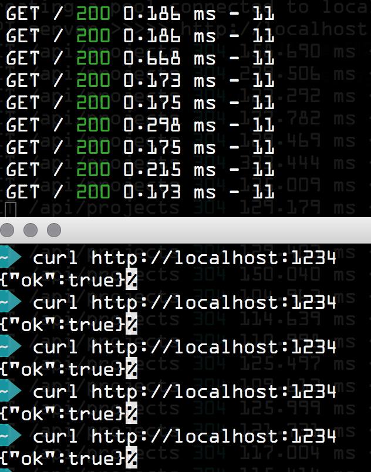

# NodeJS Response Times

A just a super simple hello world project in node.js to show that a NodeJS app
can respond in a sub-millisecond time easily.



## Hardware

The whole thing was run on this thing:

```
MacBook (Retina, 12-inch, Early 2015)
Processor 1.2 GHz Intel Core M
Memory 8 GB 1600 MHz DDR3
```

## Copyright & License

Dunno MIT I guess

Copyright (C) 2016 Nikolay Nemshilov
